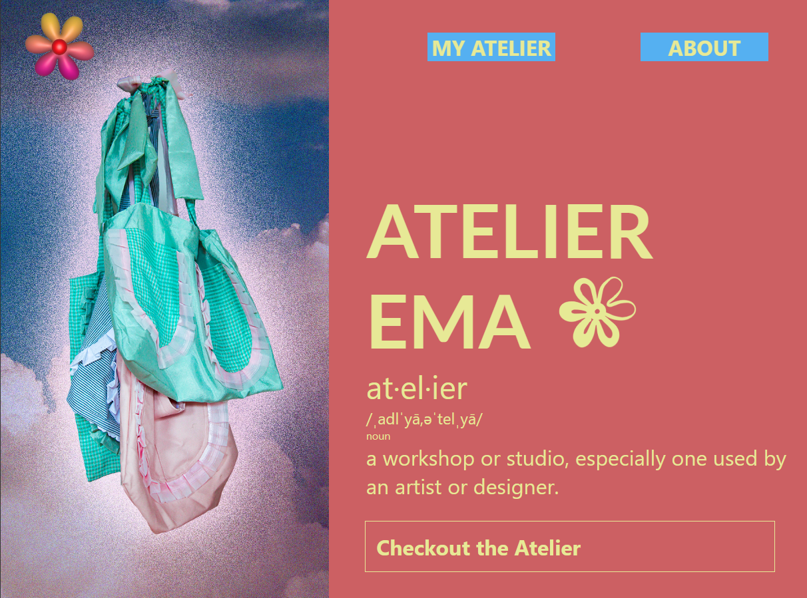

# atelier_ema

React app

## Atelier Ema Website -

This website is a blog where I will be uploading the clothing, accessories and paintings I make.

## API endpoints

  * "/api/get-blogposts"//get all blog posts
 
  * "/api/blog/:blogId" //get one blog post

## Technology Used
### Frontend
* Create React APP // Creating a React app and its environment
* React hooks // Management of UI components
* React Router // Management of router
* styled-components // Style with CSS-in-JS components
* fetch // Communicating with back-end server (Node.js) via API

### Backend
* Node.js // Backend environment
* MongoDB // Storing data

